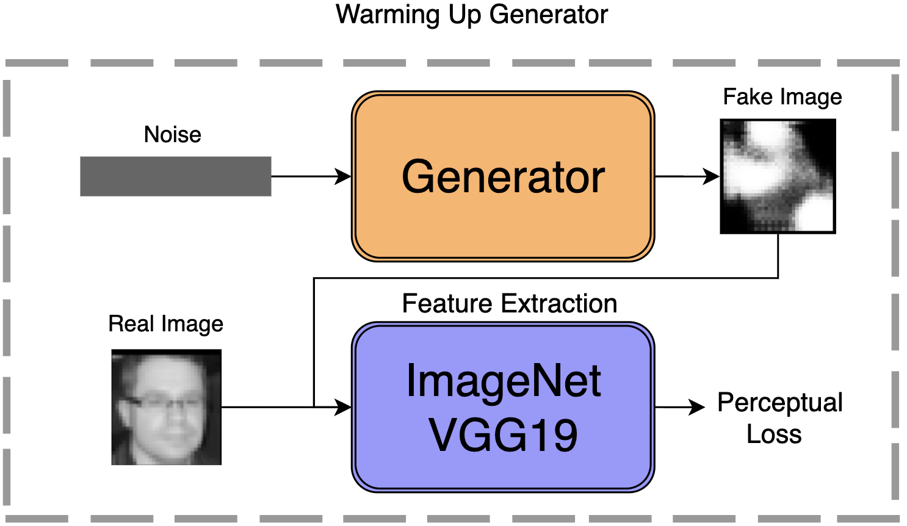
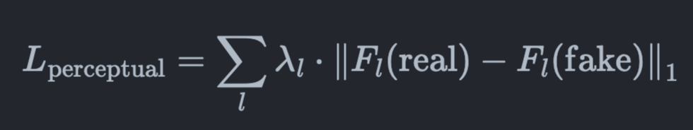
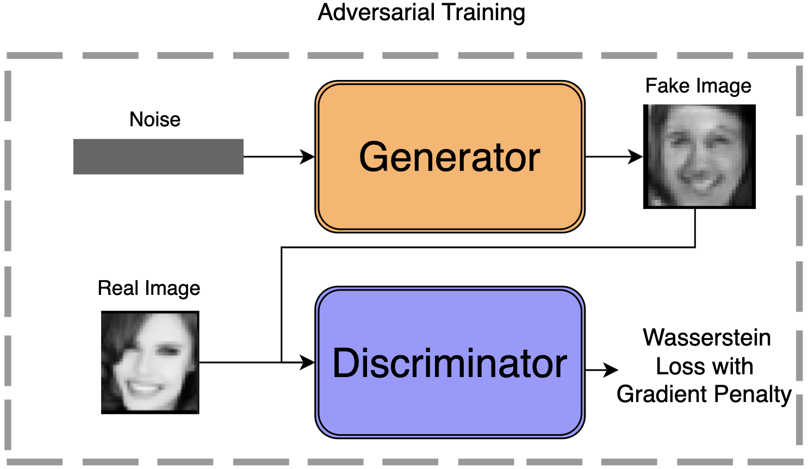

# Synthetic Data Generation for Deep Learning Model Enhancement

## Motivation

Deep learning models require substantial amounts of data to achieve high accuracy and robustness. However, the scarcity of authentic data presents a significant challenge. This project aims to address this issue by generating synthetic images to supplement the limited available data, exploring the impact on the robustness and accuracy of classification deep learning models.

## Goals

The goal of this project is to enhance the performance of a Convolutional Neural Network (CNN) classifier for emotion recognition by addressing the challenge of limited data availability. The objectives are as follows:

1. **Synthesize Data:** Employ a Generative Adversarial Network (GAN) to generate synthetic images that mimic the dataset. 
2. **Iterative Refinement:** GAN-generated images are evaluated by a CNN classifier and only those images that the classifier deems high-quality will be retained and used to further train the GAN. This feedback loop is designed to progressively improve the quality of the synthetic images.
3. **Model Enhancement:** Leverage the refined synthetic data to bolster the training set for the CNN classifier. By incorporating a larger and more diverse set of training examples, the goal is to improve the classifier's ability to accurately recognize the five target emotions.
4. **Performance Evaluation:** Conduct a thorough comparison of the CNN classifier's performance when trained on the original dataset versus the enhanced dataset containing high-confidence GAN-generated images. 

This project aims to improve the accuracy and robustness of the CNN emotion classifier utilizing the GAN-generated data to overcome challenges associated with data scarcity.

## Dataset
The dataset used for this project, FER2013, is available on Kaggle at the following link: [FER2013 Kaggle Dataset](https://www.kaggle.com/datasets/msambare/fer2013).

## Methods

A Generative Adversarial Network (GAN) is trained using WGAN-GP (Wasserstein GAN with Gradient Penalty) framework to produce synthetic images that resemble real human emotions. The CNN classifier is initially trained on the authentic dataset to establish a baseline performance. It is then used to assess the quality of GAN-generated images, and only those that meet a defined confidence threshold are added to the training set. This iterative process is repeated to refine the quality of generated images and improve the classifier's performance.

## GAN Training

### Step 1: Warming Up Generator

- Initial warming up of the generator is employed to kickstart the GAN's learning process.
- By kickstarting the generator, we aim to produce initial synthetic images that already bear some resemblance to the target dataset, thus improving the efficiency of the subsequent epochs

**Generator Loss:**
The generator loss motivates the generator to create images that the discriminator will classify as real. It is a measure of the generator's success in deceiving the discriminator, and minimizing this loss improves the generator's ability to produce realistic images.

**Perceptual Loss:**
This loss function evaluates the difference in feature representations between the real and generated images. By minimizing this loss, the generator is trained to create images that not only fool the discriminator but also closely resemble the feature distribution of real images, enhancing the visual quality of the generated images.

### Step 2: Adversarial Training

- Initially employed Binary Cross-Entropy (BCE) loss for training encountered mode collapse issues.
- Transitioned to Wasserstein loss integrated with Gradient Penalty (GP) for enhanced stability and quality in generated images.

**Minimax Loss:**
The foundational concept behind the adversarial training of GANs, representing a zero-sum game between the generator (G) and the discriminator (D).
$$\min_G \max_{D \in \mathcal{D}} \mathbb{E}_{x \sim P_r} [D(x)] - \mathbb{E}_{\tilde{x} \sim P_g} [D(\tilde{x})]$$

**Discriminator Loss:**
A combination of losses for correctly classifying real and fake images, along with a regularization term called the Gradient Penalty (GP) to enforce smoothness in the discriminator's output.
$$L_D = L_{D_{\text{real}}} + L_{D_{\text{fake}}} + \lambda_{\text{GP}} \cdot L_{\text{GP}}$$

**Gradient Penalty (GP) Loss:**
Applied to the discriminator to enforce the Lipschitz constraint by penalizing the gradient norm of the discriminator's output with respect to its input.
$$L_{\text{GP}} = \left(\left\lVert \nabla_{\hat{x}} D(\hat{x}) \right\rVert_2 - 1\right)^2$$

**Discriminator Loss Components:**
- **For Real Images**: Penalizes the discriminator for incorrectly classifying real images.
  $$L_{D_{\text{real}}} = -\frac{1}{N} \sum_{i=1}^{N} D(x_i)$$
- **For Fake Images:** This loss penalizes the discriminator for incorrectly classifying images that were generated by the GAN, encouraging it to distinguish between real and synthetic data more effectively.

**Gradient Penalty (GP) Loss:**
- Ensures the discriminator's decisions are based on features that generalize well, rather than relying on noise or irrelevant aspects of the input data.

### Step 3: Classifier-Guided Refinement

- The GAN-generated images are evaluated by the CNN classifier to ensure they are of high enough quality to be used for training. The classifier's confidence levels are used to filter out less convincing images.

## Data Update + CNN Classifier

- The high-confidence synthetic images are added to the training dataset, and the CNN classifier is retrained to incorporate the diversity of the new data.
- This process is iterated, with each cycle improving the classifier's performance and the GAN's synthetic image quality.

## Findings

- The iterative refinement process leads to a measurable improvement in the CNN classifier's performance.
- The project demonstrates that GAN-generated images can effectively supplement a limited dataset, leading to better generalization and robustness of the classifier.

## Future Directions

- Investigating more sophisticated GAN architectures and training strategies to further enhance image quality.
- Expanding the approach to other domains where data scarcity is a problem.
- Exploring the use of synthetic data in other machine learning tasks beyond classification.
